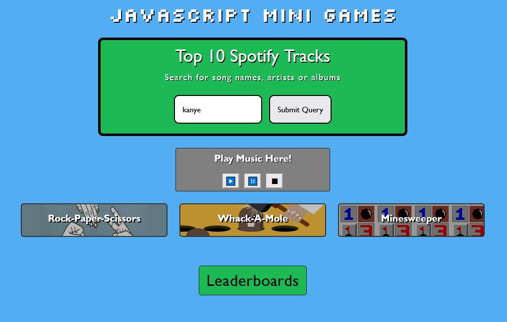
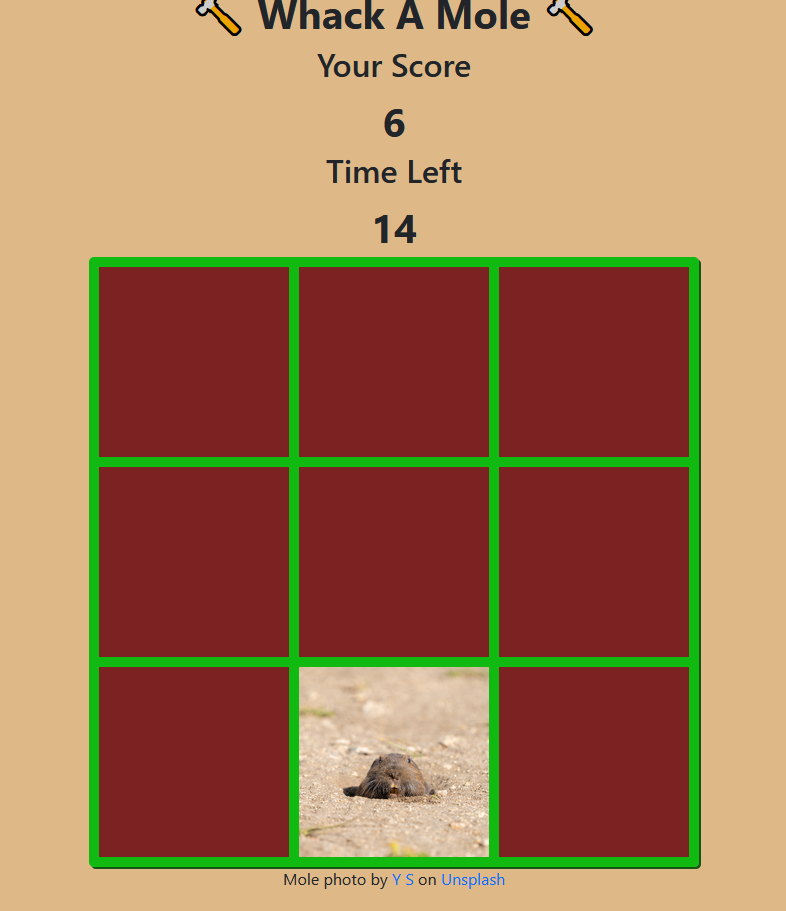
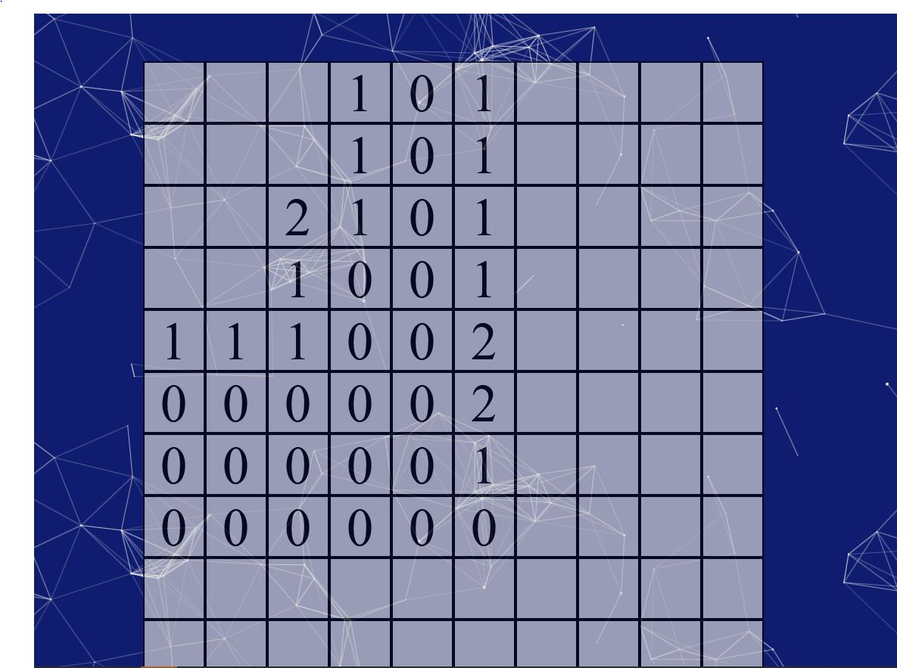
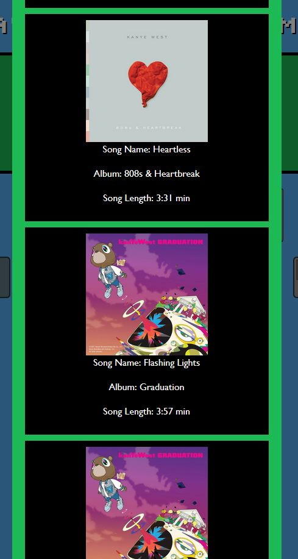

# JavaScript Mini Games (with API)

## Links

- Live Site URL: [live site](https://jon-ledo.github.io/Collab-MiniGames-plusAPI/)
- Repo: [repo](https://github.com/Jon-Ledo/Collab-MiniGames-plusAPI)
- [link to Spotify API via rapidAPI](https://rapidapi.com/Glavier/api/spotify23/)
- [link to Minesweeper API via rapidAPI](https://rapidapi.com/anpham.aph/api/minesweeper1/)

## Preview

## Tech Used

- HTML
- CSS
- Bootstrap
- JavaScript
- 3rd party API's
    -Spotify API URL: https://rapidapi.com/airaudoeduardo/api/spotify81/

## Collaborators

- [Kevin Deck](https://github.com/jungdeck)
- [Dustin Lee](https://github.com/DustinLee0)
- [Jon Ledo](https://github.com/Jon-Ledo)
- [Nebiat HMichael Nana](https://github.com/NebiatHNana)
- [Ekamjot Sidhu](https://github.com/EkamjotSidhu)

## Description

A collaborative effort to create a site that features in-browser games made using JavaScript and API’s. Anyone can visit the site and play any of the games listed, and have their final scores saved. Scores are saved to localStorage and can be viewed by clicking the Leaderboards button on the main page. This app runs in the browser and feature dynamically updating HTML and CSS.

The HTML uses classes from Bootstrap to help with styling, but most importantly creates easily responsive components. As a result, there are fewer media queries needed which really helped speed up development.

User can click on any of the large game buttons and be redirected to a new page where the game and countdown begins.

A Music component also exists to allow the playing of an mp3 file. Initially meant to link up to the Spotify API and play sounds from there, but will need to become a future feature. Instead, a user can input the name of an artist and Spotify is queried to view the top 10 tracks from that artist, all viewable within a modal.

## Games side

Page currently features three games; Rock Paper Scissors, Whack-a-Mole, and Minesweeper.

### Rock Paper Scissors

)
The classic game, is the front runner of this web page. Simply click your choice and see if you win against the computer. Rock > Scissors > Paper > Rock... Rack up as many points as possible before time runs out.

### Whack a Mole

Everyone's favourite carnival game, right here for you to play. Click (or whack) the mole image that appears on screen and accumulate your points. You have 20sec to get your high score.

### Minesweeper

A classic puzzle game from the past, re-created here. An API is used to create a 10x10 grid with predetermined lines containing numbers pertaining to the location of the mines. User clicks on a square to reveal what's underneath. Keep going until time runs out, or you hit a mine.

## Music/Spotify side

A simple audio player is featured to allow the user to play some video game music while they play their mini games. The player has buttons to start, pause and stop the audio file from playing.

After a user inputs an artist name, song name or album name and hits the submit button, Spotify API is queried and generates the top 10 tracks relating to the specified artist. In the example above, "Kanye" was the string entered and it listed the top 10 tracks relating to him.

This API is using Spotify's Search endpoint with the parameters: search input, offset = 0, limit search = 10, number of top results = 10. 
